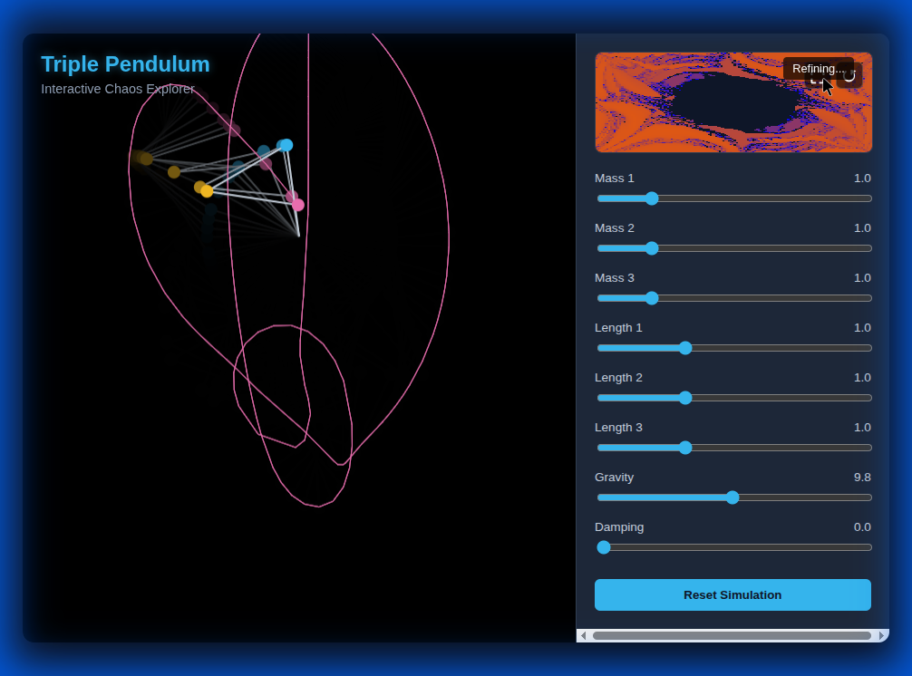

# Triple Pendulum Chaos Explorer

A high-performance, interactive simulation of a triple pendulum with a real-time stability heatmap. Built with vanilla JavaScript, HTML5 Canvas, and Web Workers.



## Features

- **Accurate Physics**: Uses Lagrangian mechanics resolved via RK4 integration for precise simulation.
- **Chaos Heatmap**: Visualizes the "Time to Flip" for different initial conditions, revealing the fractal nature of the system's stability.
    - **Progressive Rendering**: Fast previews while interacting, high-fidelity refinement when idle.
    - **Deep Zoom**: Pan and zoom into the heatmap to explore fractal structures.
- **Interactive**: click anywhere on the heatmap to teleport the simulation to that state.
- **Portable**: Runs entirely in the browser with no dependencies.

## How to Run

### Online (GitHub Pages)
[Link to your deployed site will go here]

### Locally
1. Clone this repository.
2. Because this project uses **ES Modules** and **Web Workers**, you must verify it using a local server due to browser security policies (CORS).
   ```bash
   python3 -m http.server
   # OR
   npx serve
   ```
3. Open `http://localhost:8000` in your browser.

## Controls

- **Simulation**:
    - **Sliders**: Adjust lengths (`l1`, `l2`, `l3`), masses (`m1`, `m2`, `m3`), gravity (`g`), and damping (`d`).
    - **Reset**: Restarts the simulation from a default chaotic state.
- **Heatmap**:
    - **Click**: Set simulation state to specific angles ($\theta_1, \theta_2$).
    - **Drag**: Pan the view.
    - **Scroll**: Zoom in/out.
    - **⛶**: Toggle fullscreen heatmap.
    - **↺**: Reset heatmap view.

## License

MIT
